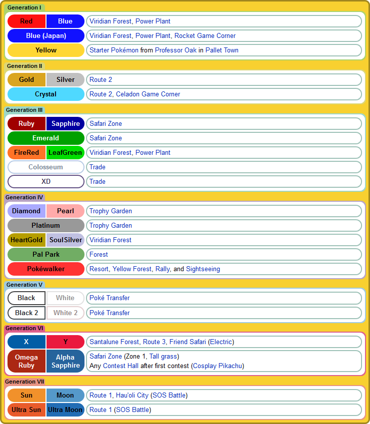

# Python Web Scraper Sample Program
Example web scraper program using [requests](http://docs.python-requests.org/en/master/) and [beautifulsoup4](https://www.crummy.com/software/BeautifulSoup/) modules. Written in Python 3.6.x.

---

As a gamer who largely plays RPG games, I've been a big fan of Pokémon games since I was a kid. Now as an adult (and much closer to being considered a "Pokémon Master" than I was as a kid), I find myself wrapped up in more complex Pokémon game details whenever I play. Having accumulated vast amounts of what I'm sure my parents would call "useless info" about the Pokémon games, I largely know exactly what information to look for when I need to query the Internet for answers: what the Male/Female gender ratio for a Pokémon species is, what Abilities a Pokémon may have, how a caught/hatched Pokémon's Nature influences its battle stats, and of course where a given Pokémon can be found in a particular game.

So to learn how web scraping works in Python, I decided to create something practical and relevant to these interests. This command-line program asks users for the name of a Pokémon, and then attempts to return information about where that Pokémon is located based on data it scrapes from the Internet. The site it scrapes data from is a popular independently maintained all-things-Pokémon database site, [Bulbapedia](https://bulbapedia.bulbagarden.net/).

For instance, everyone's lovable favorite Electric Rat Pokémon, Pikachu. Pikachu has been in every Pokémon game and is thus a perfect comprehensive example. Below is a screenshot of the game locations table on [Pikachu's Bulbapedia page](https://bulbapedia.bulbagarden.net/wiki/Pikachu_(Pok%C3%A9mon)):



When asked to retrieve game location data for Pokémon, the program scrapes the table on the above page with help from the [Requests](http://docs.python-requests.org/en/master/) and [Beautiful Soup 4](https://www.crummy.com/software/BeautifulSoup/) modules to grab all of the table's data, and then prints out the same information in a more minimal/compact form:

```
Generation I
------------
Red/Blue: Viridian Forest, Power Plant
Blue (Japan): Viridian Forest, Power Plant, Rocket Game Corner
Yellow: Starter Pokémon from Professor Oak in Pallet Town

Generation II
-------------
Gold/Silver: Route 2
Crystal: Route 2, Celadon Game Corner

Generation III
--------------
Ruby/Sapphire: Safari Zone
Emerald: Safari Zone
FireRed/LeafGreen: Viridian Forest, Power Plant
Colosseum: Trade
XD: Trade

Generation IV
-------------
Diamond/Pearl: Trophy Garden
Platinum: Trophy Garden
HeartGold/SoulSilver: Viridian Forest
Pal Park: Forest
Pokéwalker: Resort, Yellow Forest, Rally, and Sightseeing

Generation V
------------
Black/White: Poké Transfer
Black 2/White 2: Poké Transfer

Generation VI
-------------
X/Y: Santalune Forest, Route 3, Friend Safari (Electric)
Omega Ruby/Alpha Sapphire: Safari Zone (Zone 1, Tall grass), Any Contest Hall after first contest (Cosplay Pikachu)

Generation VII
--------------
Sun/Moon: Route 1, Hau'oli City (SOS Battle)
Ultra Sun/Ultra Moon: Route 1 (SOS Battle)
```

---

Requirements to run locally:
* Working Internet connection
* Python 3.x installed (ideally 3.6+)
* 'Requests' module: https://pypi.python.org/pypi/requests (install with 'pip install requests')
* 'Beautiful Soup 4' module: https://pypi.python.org/pypi/beautifulsoup4 (install with 'pip install beautifulsoup4')

Run the program via command line using **python main.py**

---

Sample program run:

```
python main.py
>Welcome to Pokémon game locations search.
>Searches website 'https://bulbapedia.bulbagarden.net' for Pokémon game locations.

>Please enter a Pokémon name, or 'exit' to exit: charizarb
Pokémon charizarb does not exist! Check for spelling errors or extra characters and try again.


>Please enter a Pokémon name, or 'exit' to exit: charizard

Charizard locations:
====================

Generation I
------------
Red/Blue: Evolve Charmeleon
Blue (Japan): Evolve Charmeleon
Yellow: Evolve Charmeleon

Generation II
-------------
Gold/Silver: Time Capsule
Crystal: Time Capsule

Generation III
--------------
Ruby/Sapphire: Trade
Emerald: Trade
FireRed/LeafGreen: Evolve Charmeleon
Colosseum: Trade
XD: Trade

Generation IV
-------------
Diamond/Pearl: Trade
Platinum: Trade
HeartGold/SoulSilver: Evolve Charmeleon
Pal Park: Field

Generation V
------------
Black/White: Poké Transfer
Black 2/White 2: Poké Transfer

Generation VI
-------------
X/Y: Evolve Charmeleon
Omega Ruby/Alpha Sapphire: Trade, Event

Generation VII
--------------
Sun/Moon: Trade
Ultra Sun/Ultra Moon: Evolve Charmeleon


>Please enter a Pokémon name, or 'exit' to exit: Salamence

Salamence locations:
====================

Generation III
--------------
Ruby/Sapphire: Evolve Shelgon
Emerald: Evolve Shelgon
FireRed/LeafGreen: Trade
Colosseum: Trade
XD: Citadark Isle (Shadow)

Generation IV
-------------
Diamond: Trade, Event
Pearl: Evolve Shelgon
Platinum: Evolve Shelgon
HeartGold/SoulSilver: Evolve Shelgon
Pal Park: Mountain

Generation V
------------
Black: Trade, Event
White: Evolve Shelgon
Black 2/White 2: Evolve Shelgon

Generation VI
-------------
X/Y: Evolve Shelgon
Omega Ruby/Alpha Sapphire: Evolve Shelgon

Generation VII
--------------
Sun/Moon: Route 3 (SOS Battle)
Ultra Sun/Ultra Moon: Route 3 (SOS Battle)


>Please enter a Pokémon name, or 'exit' to exit: Gallade

Gallade locations:
==================

Generation IV
-------------
Diamond/Pearl: Evolve Kirlia♂
Platinum: Evolve Kirlia♂
HeartGold/SoulSilver: Evolve Kirlia♂

Generation V
------------
Black: Trade
White: Evolve Kirlia♂
Black 2/White 2: Evolve Kirlia♂

Generation VI
-------------
X/Y: Evolve Kirlia♂
Omega Ruby/Alpha Sapphire: Evolve Kirlia♂

Generation VII
--------------
Sun/Moon: Trade
Ultra Sun/Ultra Moon: Evolve Kirlia♂


>Please enter a Pokémon name, or 'exit' to exit: exit

May Pokémon RNG be ever in your favor.
```

Sections of each HTML page parsed in the above example are linked below:
[https://bulbapedia.bulbagarden.net/wiki/Charizard_(Pokémon)#Game_locations](https://bulbapedia.bulbagarden.net/wiki/Charizard_(Pok%C3%A9mon)#Game_locations)
[https://bulbapedia.bulbagarden.net/wiki/Salamence_(Pokémon)#Game_locations](https://bulbapedia.bulbagarden.net/wiki/Salamence_(Pok%C3%A9mon)#Game_locations)
[https://bulbapedia.bulbagarden.net/wiki/Gallade_(Pokémon)#Game_locations](https://bulbapedia.bulbagarden.net/wiki/Gallade_(Pok%C3%A9mon)#Game_locations)

At the time, only up through Generation VII (Ultra Sun, Ultra Moon) have been released. Thus, that is the extent of the data shown in the above output.

---

Basic initial response and Beautiful Soup HTML extraction code setup borrowed from:
https://realpython.com/blog/python/python-web-scraping-practical-introduction/

This application is free to use or be built on in any reasonable way for personal/non-commercial use. Just be careful with web scraping too hard, too often--it counts as site traffic!
